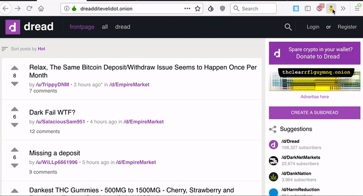

# Dark.Fail Checker
### A Tor Browser Extension to check onion URL's

### How it works
* When opened, the extension gets current URL and check if it's listed on [dark.fail](https://dark.fail)

* If there is a match, a green message is presented
* If there is no match, a red message is presented which means you are probably on SCAM site, proceed with caution

### Author
MrDeveloper

### License
MIT